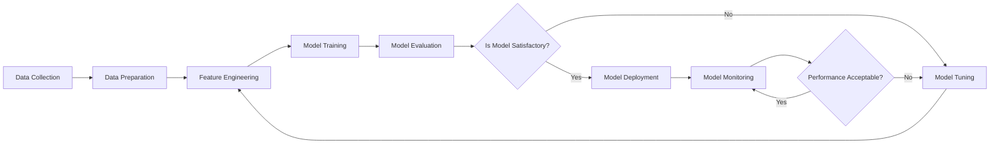

# Machine Learning: Sample Questions and Answers

Costa Rica

[brown9804](https://github.com/brown9804)

Last updated: 2025-07-16

----------

>  Describe fundamental principles of machine learning on Azure

> [!NOTE]
> The questions and answers provided in this study guide are for practice purposes only and are not official practice questions. They are intended to help you prepare for the [AI-900 Microsoft certification exam](https://learn.microsoft.com/en-us/credentials/certifications/resources/study-guides/ai-900). For additional preparation materials and the most up-to-date information, please refer to the [official Microsoft documentation](https://learn.microsoft.com/en-us/credentials/certifications/azure-ai-fundamentals/?practice-assessment-type=certification).

<b>List of References </b> (Click to expand)

- [What is a confusion matrix?](https://www.nomidl.com/machine-learning/what-is-a-confusion-matrix/)
- [Introduction to machine learning](https://learn.microsoft.com/en-us/training/modules/introduction-to-machine-learning/)
- [What is Azure Machine Learning?](https://learn.microsoft.com/en-us/azure/machine-learning/overview-what-is-azure-machine-learning?view=azureml-api-2)
- [Evaluate model performance in Machine Learning Studio (classic)](https://learn.microsoft.com/en-us/previous-versions/azure/machine-learning/classic/evaluate-model-performance)
- [Anomaly Detection](https://learn.microsoft.com/en-us/previous-versions/azure/machine-learning/studio-module-reference/anomaly-detection)
- [AI considerations for your cloud strategy](https://learn.microsoft.com/en-us/azure/cloud-adoption-framework/strategy/inform/ai)
- [Natural language processing technology](https://learn.microsoft.com/en-us/azure/architecture/data-guide/technology-choices/natural-language-processing)
- [AI learning hub](https://learn.microsoft.com/en-us/ai/?tabs=developer)
- [Microsoft Azure AI Fundamentals: AI Overview](https://learn.microsoft.com/en-us/training/paths/get-started-with-artificial-intelligence-on-azure/)

<b>List of questions/answers </b> (Click to expand)

   
- [Q1: Selecting the Appropriate Module in Azure Machine Learning Designer](#q1-selecting-the-appropriate-module-in-azure-machine-learning-designer)
- [Q2: Components in Azure Machine Learning Designer](#q2-components-in-azure-machine-learning-designer)
- [Q3: Evaluating Classification Models](#q3-evaluating-classification-models)
- [Q4: Evaluating Regression Models](#q4-evaluating-regression-models)
- [Q5: Evaluating Azure Machine Learning Designer Features](#q5-evaluating-azure-machine-learning-designer-features)
- [Q6: Identifying Machine Learning Techniques](#q6-identifying-machine-learning-techniques)
- [Q7: Identifying Machine Learning Techniques](#q7-identifying-machine-learning-techniques)
- [Q8: Identifying Machine Learning Techniques](#q8-identifying-machine-learning-techniques)
- [Q9: Deploying a Real-Time Inference Pipeline](#q9-deploying-a-real-time-inference-pipeline)
- [Q10: Accessing Azure Machine Learning Web Services](#q10-accessing-azure-machine-learning-web-services)
- [Q11: Publishing an Inference Pipeline](#q11-publishing-an-inference-pipeline)
- [Q12: Components of an Inference Pipeline](#q12-components-of-an-inference-pipeline)
- [Q13: Evaluating Machine Learning Concepts](#q13-evaluating-machine-learning-concepts)
- [Q14: Choosing the Appropriate Machine Learning Model](#q14-choosing-the-appropriate-machine-learning-model)
- [Q:15 Identifying Features for Predictive Modeling](#q15-identifying-features-for-predictive-modeling)
- [Q16: Choosing the Appropriate Machine Learning Model](#q16-choosing-the-appropriate-machine-learning-model)
- [Q17: Identifying Key Terms in Machine Learning](#q17-identifying-key-terms-in-machine-learning)
- [Q18: Matching Machine Learning Processes with Descriptions](#q18-matching-machine-learning-processes-with-descriptions)
- [Q19: Steps to Deploy an Azure Machine Learning Model](#q19-steps-to-deploy-an-azure-machine-learning-model)
- [Q20: Identifying Machine Learning Processes](#q20-identifying-machine-learning-processes)
- [Q21: Identifying Anomaly Detection Examples](#q21-identifying-anomaly-detection-examples)
- [Q22: Ensuring Transparency in Automated Machine Learning](#q22-ensuring-transparency-in-automated-machine-learning)
- [Q23: Understanding Confusion Matrix Metrics](#q23-understanding-confusion-matrix-metrics)
- [Q24: Splitting Data for Machine Learning](#q24-splitting-data-for-machine-learning)
- [Q25: Identifying Features and Labels in a Dataset](#q25-identifying-features-and-labels-in-a-dataset)
- [Q26: Features of Azure Machine Learning Designer](#q26-features-of-azure-machine-learning-designer)
- [Q27: Understanding Automated Machine Learning Capabilities](#q27-understanding-automated-machine-learning-capabilities)
- [Q28: Identifying Machine Learning Techniques](#q28-identifying-machine-learning-techniques)
- [Q29: Importance of Data Splitting in Model Training](#q29-importance-of-data-splitting-in-model-training)
- [Q30: Choosing Between Basic and Enterprise Workspaces in Azure Machine Learning](#q30-choosing-between-basic-and-enterprise-workspaces-in-azure-machine-learning)
- [Q31: Identifying Features for Predicting Plant Growth](#q31-identifying-features-for-predicting-plant-growth)
- [Q32: Identifying Examples of Clustering](#q32-identifying-examples-of-clustering)
- [Q33: Understanding the Role of a Validation Set](#q33-understanding-the-role-of-a-validation-set)

> [!TIP]
> **Core Machine Learning Types:**

| Type | Description | Use Cases | Azure Services |
|------|-------------|-----------|----------------|
| **Supervised Learning** | Learning with labeled data | Classification, regression | Azure ML Designer, AutoML |
| **Unsupervised Learning** | Finding patterns in unlabeled data | Clustering, anomaly detection | Azure ML, Cognitive Services |
| **Reinforcement Learning** | Learning through trial and error | Game AI, robotics | Azure ML, Cognitive Services |

> [!TIP]
> **Azure Machine Learning Studio Components:**

| Component | Purpose | Key Features |
|-----------|---------|--------------|
| **Designer** | Visual ML workflow creation | Drag-and-drop interface, pre-built modules |
| **AutoML** | Automated model selection | No-code ML, automatic feature engineering |
| **Notebooks** | Code-first development | Jupyter notebooks, collaborative development |
| **Datasets** | Data management | Version control, data lineage |
| **Experiments** | Track ML runs | Metrics logging, model comparison |
| **Models** | Model registry | Version management, deployment |
| **Endpoints** | Model deployment | Real-time and batch inference |

> [!TIP]
> **Model Evaluation Metrics:**

| Model Type | Primary Metrics | When to Use |
|------------|-----------------|-------------|
| **Classification** | Accuracy, Precision, Recall, F1-Score | Spam detection, image recognition |
| **Regression** | MAE, MSE, RMSE, R-squared | Price prediction, forecasting |
| **Clustering** | Silhouette Score, Inertia | Customer segmentation, data exploration |

> [!TIP]
> **Data Preparation Best Practices:**

| Process | Description | Implementation |
|---------|-------------|----------------|
| **Data Cleaning** | Remove inconsistencies and errors | Handle missing values, outliers |
| **Feature Engineering** | Create meaningful features | Combine variables, normalize data |
| **Data Splitting** | Divide data for training/testing | 70-30 or 80-20 split ratios |
| **Feature Selection** | Choose relevant features | Correlation analysis, domain knowledge |

> [!TIP]
> **Azure ML Designer Modules:**

| Module Category | Key Modules | Purpose |
|-----------------|-------------|---------|
| **Data Input/Output** | Import Data, Export Data | Connect to data sources |
| **Data Transformation** | Select Columns, Clean Missing Data | Prepare data for training |
| **Machine Learning** | Train Model, Score Model | Build and evaluate models |
| **Model Evaluation** | Evaluate Model, Cross Validate | Assess model performance |

> [!TIP]
> **Model Deployment Options:**

| Deployment Type | Use Case | Azure Service |
|-----------------|----------|---------------|
| **Real-time Inference** | Interactive applications | Azure Container Instances, AKS |
| **Batch Inference** | Bulk data processing | Azure Machine Learning Compute |
| **Edge Deployment** | IoT and offline scenarios | Azure IoT Edge |

> [!TIP]
> **Common ML Algorithms and Use Cases:**

| Algorithm | Type | Best For | Example |
|-----------|------|----------|---------|
| **Linear Regression** | Regression | Continuous predictions | House price prediction |
| **Logistic Regression** | Classification | Binary classification | Email spam detection |
| **Decision Trees** | Both | Interpretable models | Medical diagnosis |
| **Random Forest** | Both | High accuracy | Feature importance |
| **K-Means** | Clustering | Customer segmentation | Market analysis |
| **Neural Networks** | Both | Complex patterns | Image recognition |

> [!TIP]
> **Responsible AI in Machine Learning:**

| Principle | Implementation | Azure Tools |
|-----------|----------------|-------------|
| **Fairness** | Test for bias across groups | Fairness toolkit |
| **Explainability** | Understand model decisions | Model interpretability |
| **Transparency** | Document model behavior | Model cards |
| **Reliability** | Ensure consistent performance | Model monitoring |
| **Privacy** | Protect sensitive data | Differential privacy |
| **Accountability** | Human oversight | Audit trails |

> [!TIP]
> **Feature Engineering Techniques:**

| Technique | Description | When to Use |
|-----------|-------------|-------------|
| **Normalization** | Scale features to same range | Different units or scales |
| **One-Hot Encoding** | Convert categorical to binary | Categorical variables |
| **Binning** | Group continuous values | Reduce noise, create categories |
| **Feature Crossing** | Combine multiple features | Capture interactions |
| **Polynomial Features** | Create higher-order terms | Non-linear relationships |

> [!TIP]
> **Model Training Best Practices:**

| Practice | Description | Benefit |
|----------|-------------|---------|
| **Cross-Validation** | Use multiple train/test splits | More robust evaluation |
| **Hyperparameter Tuning** | Optimize model parameters | Better performance |
| **Early Stopping** | Stop when validation stops improving | Prevent overfitting |
| **Ensemble Methods** | Combine multiple models | Improved accuracy |
| **Regularization** | Add penalty for complexity | Reduce overfitting |

> [!TIP]
> **Understanding Overfitting vs Underfitting:**

| Concept | Signs | Solutions |
|---------|-------|-----------|
| **Overfitting** | High training accuracy, low validation accuracy | More data, regularization, simpler model |
| **Underfitting** | Low training and validation accuracy | More complex model, better features |
| **Good Fit** | Similar training and validation accuracy | Balanced model complexity |

> [!TIP]
> **Azure ML Workspace Tiers:**

| Tier | Features | Best For |
|------|----------|----------|
| **Basic** | Core ML capabilities | Development, learning |
| **Enterprise** | Advanced features, Designer, AutoML UI | Production, teams |

> [!TIP]
> **Data Types and ML Applications:**

| Data Type | ML Applications | Example Scenarios |
|-----------|-----------------|-------------------|
| **Structured** | Traditional ML algorithms | Sales forecasting, customer analysis |
| **Unstructured Text** | NLP, sentiment analysis | Review classification, chatbots |
| **Images** | Computer vision | Object detection, medical imaging |
| **Time Series** | Forecasting, anomaly detection | Stock prices, sensor data |
| **Audio** | Speech recognition, classification | Voice assistants, music analysis |

## Q1: Selecting the Appropriate Module in Azure Machine Learning Designer

> You need to divide an existing dataset into a training set and a validation set. Which module in Azure Machine Learning designer should you use?

**Options:**
- [ ] A. Select Columns in Dataset `This is incorrect because Select Columns in Dataset is used to choose specific columns from the dataset, not to split it.`
- [ ] B. Add Rows `This is incorrect because Add Rows is used to append rows to a dataset, not to split it.`
- [ ] C. Join Data `This is incorrect because Join Data is used to combine datasets based on a common key, not to split them.`
- [x] D. Split Data `This is the correct answer because Split Data is used to divide the dataset into separate subsets, such as training and validation sets.`

## Q2: Components in Azure Machine Learning Designer

> Which two elements can you add to the canvas in Azure Machine Learning designer?

**Options:**
- [ ] A. Compute instance `This is incorrect because compute instances are used for running experiments and training models, but they are not added to the canvas.`
- [ ] B. Experiment `This is incorrect because experiments are not individual components added to the canvas; they represent the overall process of running a series of tasks.`
- [x] C. Dataset `This is correct because datasets are essential components that provide the data used for training and evaluating models.`
- [x] D. Module `This is correct because modules are building blocks that perform specific tasks, such as data preprocessing, model training, and evaluation, and can be added to the canvas.`

## Q3: Evaluating Classification Models

> Which metric can you use to assess the performance of a classification model?

**Options:**
- [ ] A. Root Mean Squared Error (RMSE) `This is incorrect because Root Mean Squared Error (RMSE) is used to evaluate regression models, not classification models.`
- [ ] B. Mean Squared Error (MSE) `This is incorrect because Mean Squared Error (MSE) is used to evaluate regression models, not classification models.`
- [ ] C. Coefficient of Determination (R²) `This is incorrect because the Coefficient of Determination (R²) is used to evaluate regression models, not classification models.`
- [x] D. Precision `This is correct because precision measures the proportion of true positive predictions among all positive predictions made by the model.`

## Q4: Evaluating Regression Models

> Which two metrics can you use to assess the performance of a regression model? 

**Options:**
- [ ] A. Precision `This is incorrect because precision is a metric used to evaluate classification models, not regression models.`
- [ ] B. F1 score `This is incorrect because the F1 score is a metric used to evaluate classification models, not regression models.`
- [x] C. Mean Absolute Error (MAE) `This is correct because Mean Absolute Error (MAE) measures the average magnitude of errors in a set of predictions, without considering their direction.`
- [x] D. Root Mean Squared Error (RMSE) `This is correct because Root Mean Squared Error (RMSE) measures the square root of the average of squared differences between predicted and actual values.`
- [ ] E. Accuracy `This is incorrect because accuracy is a metric used to evaluate classification models, not regression models.`

## Q5: Evaluating Azure Machine Learning Designer Features

> Determine whether each of the following statements about Azure Machine Learning designer is true or false.

**Statements:**

1. Azure Machine Learning designer offers a visual interface where you can drag and drop components to create, test, and deploy machine learning models.
   - [x] Yes `This is correct because Azure Machine Learning designer provides a visual canvas for building, testing, and deploying models using drag-and-drop functionality.`
   - [ ] No
2. You can save your work as a draft pipeline in Azure Machine Learning designer to continue working on it later.
   - [x] Yes `This is correct because you can save your progress as a pipeline draft and resume your work at a later time.`
   - [ ] No
3. Azure Machine Learning designer allows you to integrate custom JavaScript functions into your pipelines.
   - [ ] Yes
   - [x] No `This is correct because Azure Machine Learning designer does not support the inclusion of custom JavaScript functions.`
4. Azure Machine Learning designer supports integration with Azure DevOps for continuous integration and deployment.
   - [x] Yes `This is correct because Azure Machine Learning designer can be integrated with Azure DevOps for CI/CD pipelines.`
   - [ ] No
5. Automated machine learning (AutoML) capabilities are available in Azure Machine Learning designer for model training.
   - [x] Yes `This is correct because Azure Machine Learning designer includes AutoML features to automate the model training process.`
   - [ ] No
6. Azure Machine Learning designer is limited to supervised learning tasks only.
   - [ ] Yes
   - [x] No `This is correct because Azure Machine Learning designer can be used for both supervised and unsupervised learning tasks.`

## Q6: Identifying Machine Learning Techniques

> Grouping customers into segments based on their purchasing behavior is an example of _________________________.

**Options:**
- [ ] classification. `This is incorrect because classification is used to categorize data into discrete classes, not to group similar data points together.`
- [x] clustering. `This is the correct answer because clustering is used to group similar data points together based on their features, such as purchasing behavior.`
- [ ] regression. `This is incorrect because regression is used to predict continuous values, not to group similar data points together.`

## Q7: Identifying Machine Learning Techniques

> Categorizing messages as spam or not spam is an example of _________________________.

**Options:**
- [ ] clustering. `This is incorrect because clustering is used to group similar data points together, not to categorize data into predefined classes.`
- [ ] regression. `This is incorrect because regression is used to predict continuous values, not to categorize data into predefined classes.`
- [x] classification. `This is the correct answer because classification is used to categorize data into discrete classes, such as spam or not spam.`

## Q8: Identifying Machine Learning Techniques

> Predicting the likelihood that a customer will buy a product based on their browsing history is an example of _________________________.

**Options:**
- [ ] classification. `This is incorrect because classification is used to categorize data into discrete classes, not to predict continuous values.`
- [ ] clustering. `This is incorrect because clustering is used to group similar data points together, not to predict continuous values.`
- [x] regression.  `This is the correct answer because regression is used to predict continuous values, such as the likelihood of a customer buying a product.`

## Q9: Deploying a Real-Time Inference Pipeline

> To perform real-time inferencing using Azure Machine Learning, where must the model be deployed for others to consume it as a service?

**Options:**
- [ ] A. A local web service `This is incorrect because a local web service is not suitable for scalable, real-time inferencing in a production environment.`
- [ ] B. Azure Container Instances `This is incorrect because Azure Container Instances are more suitable for development and testing, not for scalable, real-time inferencing.`
- [ ] C. Azure Machine Learning compute `This is incorrect because Azure Machine Learning compute is used for training models, not for deploying real-time inference endpoints.`
- [x] D. Azure Kubernetes Service (AKS) `This is the correct answer because AKS provides a scalable and reliable environment for deploying real-time inference pipelines as endpoints.`

## Q10: Accessing Azure Machine Learning Web Services

> Which two parameters are required to authenticate and access an Azure Machine Learning web service? Each correct answer presents part of the solution.

**Options:**
- [ ] A. The model name `This is incorrect because the model name is not required to access the web service.`
- [ ] B. The training endpoint `This is incorrect because the training endpoint is used for training models, not for accessing the web service.`
- [x] C. The authentication key `This is the correct answer because the authentication key is required to authenticate and access the web service.`
- [x] D. The REST endpoint `This is the correct answer because the REST endpoint is the URL used to access the web service.`

## Q11: Publishing an Inference Pipeline

> What is the purpose of publishing an inference pipeline in Azure Machine Learning?

**Options:**
- [ ] A. To train a new machine learning model `This is incorrect because publishing an inference pipeline is not related to training a new model.`
- [ ] B. To evaluate the performance of a machine learning model `This is incorrect because publishing an inference pipeline is not related to evaluating model performance.`
- [ ] C. To preprocess data before training a machine learning model `This is incorrect because publishing an inference pipeline is not related to data preprocessing.`
- [x] D. To deploy a machine learning model as a web service for real-time predictions `This is the correct answer because publishing an inference pipeline deploys the model as a web service for real-time predictions.`

## Q12: Components of an Inference Pipeline

> Which component is essential for making predictions in an inference pipeline?

**Options:**
- [ ] A. Data preprocessing module `This is incorrect because data preprocessing is used to clean and prepare the data before training the model. While important for model training, it is not directly involved in making predictions once the model is deployed.`
- [ ] B. Data visualization module `This is incorrect because data visualization is used to present data and model results in a visual format. It is not involved in the prediction process itself.`
- [ ] C. Feature selection module `This is incorrect because feature selection is used to choose the most relevant features for training the model. It is part of the model training process, not the prediction process in an inference pipeline.`
- [x] D. Trained model `This is the correct answer because the trained model is the core component that uses the input data to make predictions in an inference pipeline. Without the trained model, predictions cannot be made.`

## Q13: Evaluating Machine Learning Concepts

> Determine whether each of the following statements is true or false.

**Statements:**

1. Tagging training data with known values is called labeling.
   - [X] True. `Labeling is indeed the process of tagging training data with known values`
   - [ ] False 
2. You should evaluate a model using the same data that was used to train the model.
   - [ ] True
   - [x] False `This is correct because evaluating a model using the same data used for training can lead to overfitting and does not provide an accurate measure of model performance.`
3. Accuracy is always the primary metric used to measure a model's performance.
   - [ ] True
   - [x] False `This is correct because the primary metric used to measure a model's performance depends on the specific problem and context. Other metrics like precision, recall, and F1-score may be more appropriate in certain cases.`
4. Splitting data into training and test sets helps to evaluate the model's performance on unseen data.
   - [x] True `This is correct because splitting data into training and test sets allows for evaluating the model's performance on data it has not seen during training, providing a more accurate assessment.`
   - [ ] False
5. Feature engineering involves creating new features from existing data to improve model performance.
   - [x] True `This is correct as feature engineering involves creating new features from existing data to improve model performance.`
   - [ ] False

## Q14: Choosing the Appropriate Machine Learning Model

> You need to predict the temperature in degrees Celsius for the next week. Which type of machine learning should you use?

**Options:**
- [ ] A. Classification `This is incorrect because classification models categorize data into discrete classes, not continuous values.`
- [ ] B. Clustering `This is incorrect because clustering models group data into clusters based on similarity, not predict continuous values.`
- [x] C. Regression `This is the correct answer because regression models predict continuous values, such as temperature.`

## Q:15 Identifying Features for Predictive Modeling

> You have a dataset that contains information about house sales in a city. You need to train a model to predict the price of a house. What should you use as a feature?

**Options:**
- [ ] A. The number of houses sold in the dataset `This is incorrect because the number of houses sold is not directly related to predicting the price of an individual house.`
- [ ] B. The house ID `This is incorrect because the house ID is a unique identifier and does not provide useful information for predicting the price.`
- [ ] C. The price of individual houses `This is incorrect because the price is the target variable you are trying to predict, not a feature.`
- [x] D. The size of the house in square feet `This is the correct answer because the size of the house is a relevant feature that can influence its price.`

## Q16: Choosing the Appropriate Machine Learning Model

> Which type of machine learning should you use to categorize customer reviews as positive, neutral, or negative?

**Options:**
- [ ] A. Regression `This is incorrect because regression models predict continuous values, not discrete categories.`
- [ ] B. Clustering `This is incorrect because clustering models group data into clusters based on similarity, not categorize data into predefined classes.`
- [x] C. Classification `This is the correct answer because classification models are used to categorize data into discrete classes, such as positive, neutral, or negative reviews.`

## Q17: Identifying Key Terms in Machine Learning

> Data values that the model aims to predict are called:

**Options:**
- [ ] A. Features `This is incorrect because features are the input variables used to make predictions.`. They are the measurable properties or characteristics of the data. For example, in a dataset predicting house prices, features might include the size of the house, the number of bedrooms, and the location.
- [ ] B. Identifiers `This is incorrect because identifiers are unique values used to distinguish different records.`
- [ ] C. Independent variables `This is incorrect.`. This term is often used interchangeably with features. Independent variables are the variables that are manipulated or used to predict the outcome (dependent variable). In the context of machine learning, independent variables are the same as features.
- [x] D. Labels `This is the correct answer because labels are the output variables that the model aims to predict.`

## Q18: Matching Machine Learning Processes with Descriptions

> Match the machine learning processes to their appropriate descriptions.

**Learning Types:**
1. Data preprocessing
2. Model evaluation
3. Model deployment
4. Feature engineering
5. Model training

**Descriptions:**
- [ ] A. Cleaning and organizing raw data to make it suitable for training.
- [ ] B. Creating new features from existing data to improve model performance.
- [ ] C. Using the trained model to make predictions on new data.
- [ ] D. Assessing the performance of the trained model using metrics like accuracy and precision.
- [ ] E. Teaching the model to make predictions based on the training data.

**Answers:**
- [`Data preprocessing`] A. Cleaning and organizing raw data to make it suitable for training. `This is the correct answer because data preprocessing involves preparing raw data for use in training.`
- [`Feature engineering`] B. Creating new features from existing data to improve model performance. `This is the correct answer because feature engineering involves generating new features to enhance model accuracy.`
- [`Model deployment`] C. Using the trained model to make predictions on new data. `This is the correct answer because model deployment involves putting the trained model into production to make real-time predictions.`
- [`Model evaluation`] D. Assessing the performance of the trained model using metrics like accuracy and precision. `This is the correct answer because model evaluation involves measuring how well the model performs.`
- [`Model training`] E. Teaching the model to make predictions based on the training data. `This is the correct answer because model training involves using data to train the model to make accurate predictions.`

## Q19: Steps to Deploy an Azure Machine Learning Model

> You plan to deploy an Azure Machine Learning model as a service that will be used by client applications. What are the three processes you should perform in sequence before deploying the model?

**Options:**
- [ ] A. Data Encryption `This is not a necessary step before deploying the model, although it is important for data security.`
- [ ] B. Model Retraining `This is not a necessary step before the initial deployment of the model.`
- [x] C. Data Preparation `This is the correct answer because it involves cleaning and organizing the data to ensure it is suitable for training the model.`
- [x] D. Model Training `This is the correct answer because it involves using the prepared data to train the machine learning model.`
- [x] E. Model Evaluation `This is the correct answer because it involves evaluating the model to ensure it meets the desired performance criteria before deployment.`

## Q20: Identifying Machine Learning Processes

> ____________ is used to create new features from raw data to improve the performance of a machine learning model.

**Options:**
- [ ] A. Data preprocessing
- [ ] B. Model training
- [ ] C. Model evaluation
- [x] D. Feature engineering

**Answers:**
- [`Data preprocessing`] A. Data preprocessing `This is incorrect because data preprocessing involves cleaning and preparing the data, not creating new features.`
- [`Model training`] B. Model training `This is incorrect because model training involves teaching the model to make predictions based on the data, not creating new features.`
- [`Model evaluation`] C. Model evaluation `This is incorrect because model evaluation involves assessing the performance of the trained model, not creating new features.`
- [`Feature engineering`] D. Feature engineering `This is the correct answer because feature engineering involves creating new features from raw data to improve the performance of a machine learning model.`

## Q21: Identifying Anomaly Detection Examples

> Determine whether each of the following scenarios is an example of anomaly detection.

**Statements:**

1. Predicting stock prices based on historical data.
   - [ ] Yes
   - [x] No `This is incorrect because predicting stock prices is a regression problem, not anomaly detection.`
2. Classifying emails as spam or not spam based on their content.
   - [ ] Yes
   - [x] No `This is incorrect because classifying emails is a classification problem, not anomaly detection.`
3. Detecting fraudulent transactions by identifying unusual spending patterns.
   - [x] Yes `This is correct because detecting fraudulent transactions involves identifying deviations from normal behavior, which is an example of anomaly detection.`
   - [ ] No

## Q22: Ensuring Transparency in Automated Machine Learning

> When developing a machine learning model through an automated machine learning user interface (UI), what steps should be taken to ensure the model adheres to Microsoft's transparency principle for responsible AI?

**Options:**
- [ ] A. Set Validation type to Auto. `This is incorrect because setting the validation type to auto does not directly address the transparency principle.`
- [ ] B. Set Primary metric to accuracy. `This is incorrect because setting the primary metric to accuracy focuses on performance, not transparency.`
- [ ] C. Set Max concurrent iterations to 0. `This is incorrect because setting the maximum concurrent iterations to 0 does not relate to transparency and would likely hinder the model training process.`
- [x] D. Enable Explain best model. `This is the correct answer. Enabling the "Explain best model" feature provides insights into how the model makes decisions, which aligns with the transparency principle by making the model's workings understandable.`

## Q23: Understanding Confusion Matrix Metrics

> You are working on developing a classification model to predict outcomes. The confusion matrix for the model, evaluated on test data, is provided below:

|       | Actual Negative | Actual Positive |
|-------|-----------------|-----------------|
| Predicted Negative | 950             | 20              |
| Predicted Positive | 30              | 14000           |

Select the answer choice that completes each statement based on the information presented in the confusion matrix. 

**Options:**

1. There are [answer choice] correctly predicted positives.
    - [ ] 20 `This is incorrect because 20 represents the false negatives.`
    - [ ] 30 `This is incorrect because 30 represents the false positives.`
    - [ ] 950 `This is incorrect because 950 represents the true negatives.`
    - [x] 14000 `This is the correct answer. 14000 represents the true positives, which are the correctly predicted positive cases.`
        
2. There are [answer choice] false negatives.
    - [ ] 30 `This is incorrect because 30 represents the false positives.`
    - [ ] 950 `This is incorrect because 950 represents the true negatives.`
    - [ ] 14000  `This is incorrect because 14000 represents the true positives.`
    - [x] 20 `This is the correct answer. 20 represents the false negatives, which are the actual positive cases incorrectly predicted as negative.`

From [What is a confusion matrix?](https://www.nomidl.com/machine-learning/what-is-a-confusion-matrix/)

  

## Q24: Splitting Data for Machine Learning

> In a machine learning process, how should you split your data for training and evaluation to ensure effective model development?

**Options:**
- [ ] A. Use features for training and labels for evaluation. `This is incorrect because features are the input data used for training the model, while labels are the output data used for evaluation.`
- [ ] C. Use labels for training and features for evaluation. `This is incorrect because labels are the target outputs that the model aims to predict, and features are the inputs used to train the model.`
- [ ] B. Randomly split the data into columns for training and columns for evaluation. `This is incorrect because splitting data by columns would separate features from labels, making it impossible to train the model effectively.`
- [x] D. Randomly split the data into rows for training and rows for evaluation. `This is the correct answer. Randomly splitting the data into rows ensures that both the training and evaluation sets are representative of the overall dataset, leading to more reliable model performance.`

## Q25: Identifying Features and Labels in a Dataset

You have the following dataset.

| Age | Zip Code | Insurance Premium Category |
|-----|----------|----------------------------|
| 30  | 12345    | Low                        |
| 45  | 67890    | Medium                     |
| 60  | 54321    | High                       |

> You are building a model to predict the insurance premium categories of individuals. What are Age and Insurance Premium Category?

**Age:**
- [x] A feature. `This is the correct answer because Age is an input variable used to make predictions, making it a feature.`
- [ ] A label

**Insurance Premium Category:**
- [ ] A feature
- [x] A label.  `This is the correct answer because Insurance Premium Category is the output variable that the model aims to predict, making it a label.`

## Q26: Features of Azure Machine Learning Designer

> Azure Machine Learning designer allows you to create machine learning models by:

**Options:**
- [ ] A. Writing all code manually without any visual aids. Code first notebook. `This is incorrect because Azure Machine Learning designer offers a visual interface for model building.`
- [ ] B. Manually selecting and tuning algorithms without any automation. `This is incorrect because Azure Machine Learning designer can automatically select and tune algorithms.`
- [ ] C. Using only pre-built models without any customization. `This is incorrect because Azure Machine Learning designer allows for customization and building models from scratch.`
- [x] D. Adding and connecting modules on a visual canvas. `This is the correct answer because Azure Machine Learning designer enables you to create models by visually adding and connecting modules.`

## Q27: Understanding Automated Machine Learning Capabilities

> Determine whether each of the following statements about automated machine learning (AutoML) is true or false.

**Statements:**

1. AutoML allows you to integrate custom Python scripts into the training pipeline.
   - [ ] Yes
   - [x] No `This is correct because AutoML supports the inclusion of custom Python scripts in the training pipeline.`
2. AutoML enables you to build machine learning models without requiring programming skills.
   - [x] Yes `This is correct because AutoML simplifies the process of building machine learning models, making it accessible to users without programming experience.`
   - [ ] No
3. AutoML provides a visual interface to connect datasets and modules interactively.
   - [ ] Yes
   - [x] No `This is correct because AutoML does not offer a visual interface for connecting datasets and modules; this feature is available in Azure Machine Learning designer.`

## Q28: Identifying Machine Learning Techniques

> A hospital uses a large dataset of patient records that are labeled as either `disease present` or `disease not present`. You need to use machine learning to support the early detection of the disease in new patient records before they are reviewed by a doctor. This is an example of which type of machine learning?

**Options:**
- [ ] A. Clustering `This is incorrect because clustering is used to group similar data points together, not to categorize data into predefined classes.`
- [ ] B. Regression `This is incorrect because regression is used to predict continuous values, not to categorize data into predefined classes.`
- [x] C. Classification `This is the correct answer because classification is used to categorize data into predefined classes, such as "disease present" and "disease not present."`

## Q29: Importance of Data Splitting in Model Training

> Why is it important to randomly divide the dataset into separate subsets when training a machine learning model?

**Options:**
- [ ] A. To train the model twice to achieve higher accuracy. `This is incorrect because training the model twice does not necessarily improve accuracy and is not the purpose of data splitting.`
- [ ] B. To train multiple models at the same time for better performance. `This is incorrect because training multiple models simultaneously is not the reason for splitting the dataset.`
- [x] C. To evaluate the model using data that was not part of the training set. `This is the correct answer because splitting the dataset allows for testing the model on unseen data, providing a more accurate assessment of its performance.`

## Q30: Choosing Between Basic and Enterprise Workspaces in Azure Machine Learning

> You are deciding whether to use a basic workspace or an enterprise workspace in Azure Machine Learning.
> Which two tasks specifically require an enterprise workspace? Each correct answer presents a complete solution.

**Options:**
- [ ] A. Set up a compute instance to use as a workstation. `This is incorrect because creating a compute instance can be done in both basic and enterprise workspaces.`
- [ ] B. Create a dataset from a comma-separated value (CSV) file. `This is incorrect because creating a dataset from a CSV file can be done in both basic and enterprise workspaces.`
- [X] C. Utilize a graphical user interface (GUI) to run automated machine learning experiments. `This is correct because running automated machine learning experiments using a GUI requires an enterprise workspace.`
- [X] D. Use a graphical user interface (GUI) to design and execute machine learning experiments with Azure Machine Learning designer. `This is correct because using the Azure Machine Learning designer's GUI for defining and running experiments requires an enterprise workspace.`

## Q31: Identifying Features for Predicting Plant Growth

> You need to predict the growth rate of a plant species using the following dataset.

| Plant Species | Soil Type | Watering Frequency | Sunlight Exposure | Growth Rate |
|---------------|-----------|--------------------|-------------------|-------------|
| Fern          | Loamy     | Daily              | Partial Shade     | Fast        |
| Cactus        | Sandy     | Weekly             | Full Sun          | Slow        |
| Rose          | Clay      | Every Other Day    | Full Sun          | Medium      |
| Bamboo        | Loamy     | Daily              | Full Sun          | Fast        |
| Orchid        | Peaty     | Weekly             | Partial Shade     | Slow        |

Which three fields should you use as features? Each correct answer presents a complete solution.

**Options:**
- [ ] A. Plant Species. `This is incorrect because Plant Species is not a feature used to predict growth rate; it is more of a categorical identifier.`
- [ ] B. Growth Rate. `This is incorrect because Growth Rate is the target variable you are trying to predict, not a feature.`
- [x] C. Soil Type. `This is correct because Soil Type is a relevant feature that can influence plant growth.`
- [x] D. Watering Frequency. `This is correct because Watering Frequency is a relevant feature that can influence plant growth.`
- [x] E. Sunlight Exposure. `This is correct because Sunlight Exposure is a relevant feature that can influence plant growth.`

## Q32: Identifying Examples of Clustering

> Determine whether each of the following scenarios is an example of clustering.

**Statements:**

1. Categorizing news articles into topics such as sports, politics, and technology.
   - [ ] Yes
   - [x] No `This is incorrect because categorizing news articles into predefined topics is an example of classification, not clustering.`
2. Grouping customers based on their purchasing behavior to identify market segments.
   - [x] Yes `This is correct because grouping customers based on similarities in their purchasing behavior is an example of clustering.`
   - [ ] No
3. Predicting the price of a house based on its features such as size, location, and number of bedrooms.
   - [ ] Yes
   - [x] No `This is incorrect because predicting the price of a house is an example of regression, not clustering.`

## Q33: Understanding the Role of a Validation Set

> Determine whether each of the following statements about a validation set is true or false.

**Statements:**

1. A validation set consists of the input examples used to train a model.
   - [ ] True
   - [x] False `This is correct because a validation set is not used for training the model; it is used to evaluate the model's performance.`
2. A validation set helps assess how accurately a model predicts labels.
   - [x] True `This is correct because a validation set is used to evaluate the model's predictive accuracy on unseen data.`
   - [ ] False
3. A validation set ensures that all training data has been utilized in training the model.
   - [ ] True
   - [x] False `This is correct because a validation set is separate from the training data and is not used to verify the usage of all training data.`

<!-- START BADGE -->

  
  
Refresh Date: 2025-08-05

<!-- END BADGE -->
