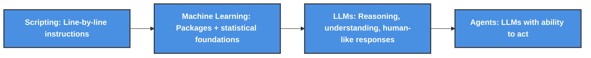

# Study Guide: Azure AI Fundamentals (AI-900)

Costa Rica

[brown9804](https://github.com/brown9804)

Last updated: 2025-07-22

----------

> A landing zone is a general `cloud framework that sets up the core structure for all workloads`. Each use case (like an app, data pipeline, or API) then builds on top of this framework, using the `same environments (Dev → Test → UAT → Prod) and CI/CD pipelines to move code safely into production.` It’s general by design, but `applied per use case.`

> [!NOTE]
> The questions and answers provided in this study guide are for practice purposes only and are not official practice questions. They are intended to help you prepare for the [AI-900 Microsoft certification exam](https://learn.microsoft.com/en-us/credentials/certifications/resources/study-guides/ai-900). For additional preparation materials and the most up-to-date information, please refer to the [official Microsoft documentation](https://learn.microsoft.com/en-us/credentials/certifications/azure-ai-fundamentals/?practice-assessment-type=certification). Read all here [Study guide for Exam AI-900: Microsoft Azure AI Fundamentals](https://learn.microsoft.com/en-us/credentials/certifications/resources/study-guides/ai-900)

> `How we move from basic coding all the way to AI agents?`

<b> More details about it here </b> (Click to expand)

  
> - We all `start with scripting`, no matter the language, it’s the first step. `Simple/complex instructions, written line by line`, to get something done
> - Then comes `machine learning`. At this stage, we’re not reinventing the math, we’re `leveraging powerful packages built on deep statistical and mathematical foundations.` These tools let us `automate smarter processes, like reviewing claims with predictive analytics. You’re not just coding anymore; you’re building systems that learn and adapt.`
> - `LLMs`. This is what most people mean when they say `AI.` Think of `yourself as the architect, and the LLM as your strategic engine. You can plug into it via an API, a key, or through integrated services. It’s not just about automation, it’s about reasoning, understanding, and generating human-like responses.`
> - And finally, `agents`. These are LLMs with the `ability to act`. They don’t just respond, `they take initiative. They can create code, trigger workflows, make decisions, interact with tools, with other agents. It’s where intelligence meets execution`

## Content

- [Artificial Intelligence: Sample Questions and Answers](./0_AI-questions.md)
- [Machine Learning: Sample Questions and Answers](./1_ML-questions.md)
- [Computer Vision: Sample Questions and Answers](./2_CV-questions.md)

## Skills measured

- Describe Artificial Intelligence workloads and considerations
- Describe fundamental principles of machine learning on Azure
- Describe features of computer vision workloads on Azure
- Describe features of Natural Language Processing (NLP) workloads on Azure
- Describe features of generative AI workloads on Azure

> [!TIP]
> Check out [Certification poster](https://arch-center.azureedge.net/Credentials/Certification-Poster-en-us.pdf)

  

Badge from [Credly](https://www.credly.com/org/microsoft-certification/badge/microsoft-certified-azure-ai-fundamentals)

<!-- START BADGE -->

  
  
Refresh Date: 2025-08-05

<!-- END BADGE -->
